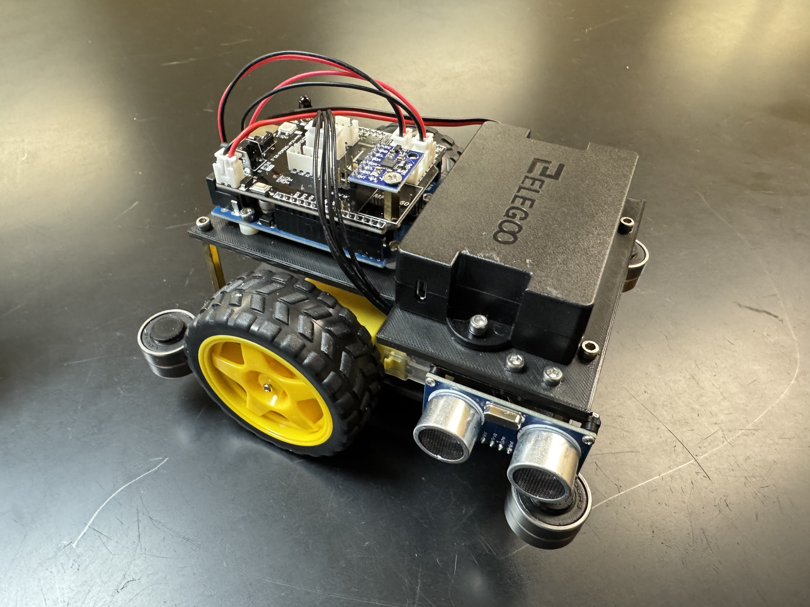

# NRC Maze Robot Tutorial

## About
I was going to participate in the National Robotics Challenge as part of my high school’s Engineering Team that I lead until some stuff happened. However, I am making this tutorial under the CC BY-NC-ND license so that the designs and code are accessible to anyone. If you used this tutorial or found it helpful, I would appreciate if you starred it or even shared it with your friends.

## Competition
The [National Robotics Challenge](https://www.thenrc.org/) takes place each Spring in Marion, Ohio. There are multiple different contests with different levels of difficulty. This tutorial is specifically for the Robot Maze Contest, which involves building and programming a robot to navigate a right/left turn maze. The maze is 10 segments by 10 segments, which each segment being 10 inches by 10 inches. However, the internal navigable is 9.25 inches because the walls have width. The robot must be no larger than 7x7x7 inches and must be completely autonomous (no remote controls or tethers). It must be in contact with the ground at all times and has up to five minutes to complete a run, where faster is better.

## Robot Information
This robot meets those design criteria. It can basically be made out of parts from the [ELEGOO Smart Robot Car Kit V4.0](https://www.amazon.com/ELEGOO-Tracking-Ultrasonic-Intelligent-Educational/dp/B07KPZ8RSZ), with everything else being 3D printed or quite inexpensive. The robot moves forward through each segment one at a time, which ensures that it is centered before executing a turn. When it does execute a turn, wherever possible, it moves forward until it is square with the wall and then backs up to do the turn. This realignment functionality helps minimize drift. The robot also checks if all turns are accurate using the MPU, and if that is not the case, then the robot self-corrects. For long stretches of wall that are on the right side of the robot, it can use a PD controller to hug that wall.

## Code Explanation
The only function that is not used is the `mpuAngles` one, which prints all three axes to Serial. Other than that, every line of the code is necessary for the robot to work properly. The first part of the code handles all the variable definitions, followed by the `setup` for things like pin modes. Then there is the main `loop` function, which detects if the button is pressed, and if so, starts doing the maze logic. The rest of it is organized into a bunch of sections with each section containing a few related helper functions for moving, reading from sensors, etc. This is also where the PD controller and check turn function live. The code is fully commented, so you should have no trouble understanding it, and if you can't, then your coding skills are probably not good enough to be competing in the first place.

## Robot Tutorial
Print out the top plate, bottom plate, bearing stoppers, and both ultrasonic mounts according to the specified [print settings](printSettings.md). All five files are in the `printedParts` folder. Then, check out the [parts list](partsList.md) and make sure you have everything else. Next, read the [instructions](instructions.md) to assemble your robot. Lastly, run the [code](mazeCode/mazeCode.ino) on your finished robot. It is currently set to the maze layout for 2025.

## Notes

### Pictures
This tutorial currently does not include any pictures besides the ones in the parts list. I will update it with them as soon as possible so that it is easier to follow.

### Crediting
As part of the license included in this repository (see below), you must credit me in your Engineer's Notebook. It would be dishonest and unethical to pass this off as your own because you didn't do the work.

## Contributors
Sachin Agrawal: I'm a self-taught programmer who knows many languages and I'm into app, game, and web development. For more information, check out my website or Github profile. If you would like to contact me, my email is [github@sachin.email](mailto:github@sachin.email).

## License
This package is licensed under the [Creative Commons BY-NC-ND License](LICENSE.txt). For more information, please visit their [website](https://creativecommons.org/share-your-work/use-remix/cc-licenses/#by-nc-nd). I am only giving permission to edit the layout of the maze since it changes each year, and delays timings as needed. Otherwise, please respect the No Derivatives part of the license and do not alter any of the remaining code. This also means that you are not allowed to put this code into ChatGPT to shorten or change it in any way. What is said here takes precedence over anything said elsewhere, either in person or on online messaging platforms. 